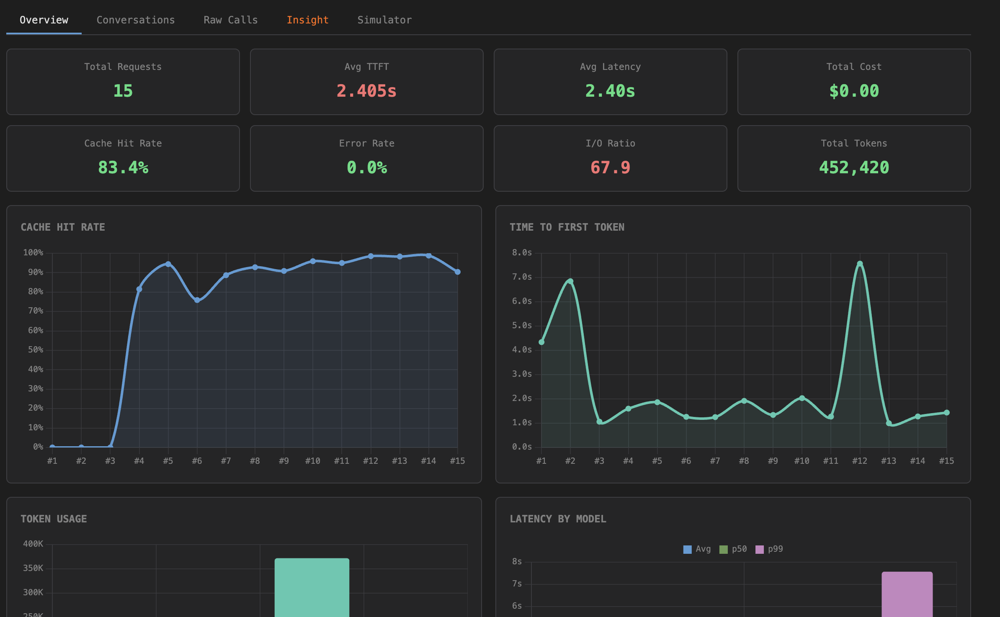
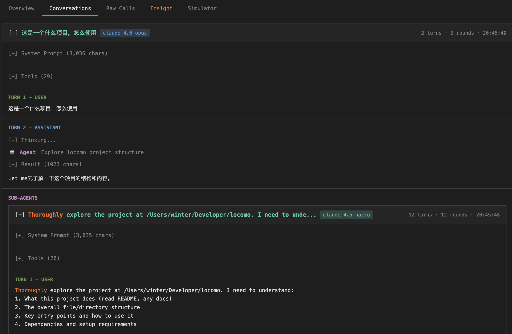
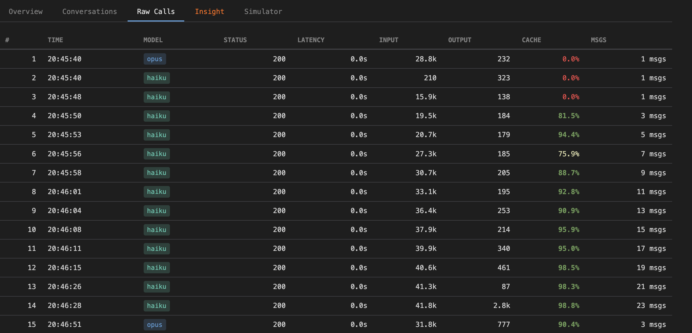
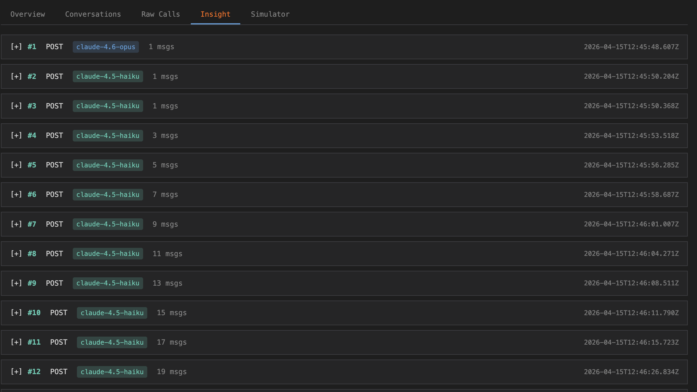
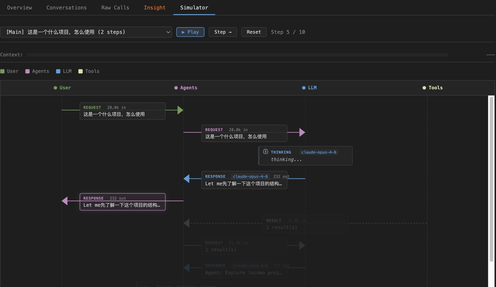

# tracecc

Trace and analyze Claude Code API traffic. Captures requests via HTTP proxy or reads Claude Code's native `.jsonl` logs offline.

## Quick Start

```bash
npm install
npm start        # opens http://localhost:3001
```

## Features

**Proxy Mode** — intercept live API traffic

1. Enter target domain, click START (proxy on `:8080`)
2. Claude Code's `ANTHROPIC_BASE_URL` auto-switches to the proxy
3. Use Claude Code normally — all traffic is logged
4. Click STOP — settings restored, logs saved as `log-<timestamp>.jsonl`

**Analyze Mode** (`/analyze`) — offline log analysis

- Browse `.jsonl` files from `~/.claude/projects/`
- Token usage, cost breakdown, model distribution, cache hit rates
- Automatically loads sub-agent logs from `subagents/` directories

**Analyze / Report Mode** — 5 tabs for exploring captured data

| Tab | Description |
|-----|-------------|
| **Overview** | Cost breakdown, token usage charts, model distribution, cache hit rates |
| **Conversations** | Chat history split by user input, with thinking, tool calls, and sub-agent linking |
| **Raw Calls** | Every API call with status, latency, input/output tokens, and cache stats |
| **Insight** | Raw request/response payloads and SSE event streams |
| **Simulator** | Swim-lane diagram replaying the request flow across user, agents, LLM, and tools |

### Screenshots

**Overview** — token usage, cost, cache hit rate, TTFT charts



**Conversations** — chat turns with tool calls and sub-agent linking



**Raw Calls** — per-request metrics table



**Insight** — raw request/response payloads



**Simulator** — swim-lane request flow diagram



```bash
# CLI report generation
node generate-report.js <input.jsonl> [output.html]
```

## Supported Log Formats

| Format | Source | Sub-agent detection |
|--------|--------|---------------------|
| Proxy-captured | `log-*.jsonl` from proxy mode | Heuristic (model + system prompt length) |
| Claude Code native | `~/.claude/projects/**/*.jsonl` | Exact (`isSidechain` metadata) |

## Commands

```
make install    # npm install
make start      # start server
make stop       # kill server
make report     # generate report from latest log
make clean      # remove generated files
```

## License

MIT
